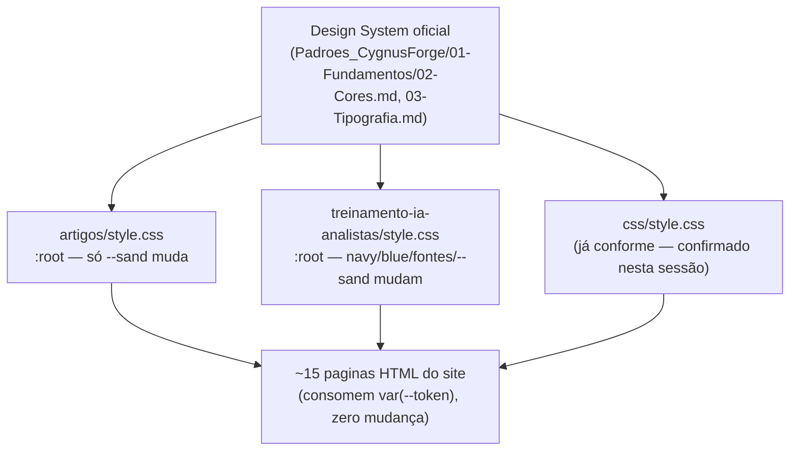

# Unificação de Tokens Visuais do Site — Design

**Spec**: `.specs/features/unificacao-tokens-visuais-site/spec.md`
**Status**: Approved

---

## Architecture Overview

Investigação prévia (grep + leitura completa das 3 stylesheets) mudou a estimativa de escopo pra
baixo: `artigos/style.css` **já usa os valores corretos** de azul de marca (`--navy:#0F2D6B`,
`--blue:#184194`) — só `treinamento-ia-analistas/style.css` diverge de verdade (foi copiado de
`artigos/style.css` e depois teve navy/blue/fontes trocados por outros valores, mas manteve
idênticos todos os outros tokens — `--ink`, `--line`, `--teal`, `--amber`, `--rose`, `--green`,
`--purple`, `--radius-*`, `--shadow-*` são byte-a-byte iguais entre os dois arquivos). A superfície
real de mudança é pequena: dois blocos `:root` + uma linha de `@import` de Google Fonts. Nenhum
arquivo HTML precisa ser tocado — as ~15 páginas do site referenciam os tokens por `var(--nome)`,
nunca hex direto (exceção: 2 arquivos com hex inline já confirmados fora de escopo — acentos de
módulo e legendas de diagrama, ver spec.md Out of Scope).

---

## Code Reuse Analysis

### Existing Components to Leverage

| Component | Location | How to Use |
| --- | --- | --- |
| Bloco `:root` de `css/style.css` (já conforme o Design System) | `site/css/style.css:7-54` | Fonte dos valores corretos a copiar para os outros 2 arquivos — não reinventar |
| `Padroes_CygnusForge/01-Fundamentos/02-Cores.md` e `03-Tipografia.md` | design system | Fonte da verdade para qualquer valor que `css/style.css` não cubra |

### Integration Points

| System | Integration Method |
| --- | --- |
| `artigos/style.css` | Edita só o valor de `--sand` no `:root` (renomeado para `--bg-page`, 1 uso) — resto já conforme |
| `treinamento-ia-analistas/style.css` | Edita `--navy`, `--navy-mid`, `--blue`, `--blue-hover`, `--blue-light`, `--blue-pale`, `--font-head`, `--font-body` no `:root`; remove a linha `@import` de Google Fonts; renomeia `--sand` → `--bg-page` (1 uso) |

---

## Components

### `artigos/style.css` — ajuste de fundo de leitura

- **Purpose**: Único ajuste necessário neste arquivo — trocar o fundo de leitura quente por um frio.
- **Location**: `site/artigos/style.css`
- **Mudança**: `--sand: #f8f6f1` → renomear para `--bg-page: #F8F9FA`; `background: var(--sand)` (linha 53, único uso) → `background: var(--bg-page)`.
- **Dependencies**: Nenhuma — mudança isolada, sem efeito em cascata (só 1 uso da variável).
- **Reuses**: Valor já usado como `--bg-alt` em `css/style.css`.

### `treinamento-ia-analistas/style.css` — realinhamento completo de marca e fonte

- **Purpose**: Trazer a paleta de azul e a família tipográfica de volta à conformidade com o Design System oficial.
- **Location**: `site/treinamento-ia-analistas/style.css`
- **Mudanças no `:root`**:
  - `--navy: #0d1b2a` → `#0F2D6B`
  - `--navy-mid: #1a3160` → `#184194`
  - `--blue: #1d6fcd` → `#184194`
  - `--blue-hover: #1558a8` → `#0F2D6B`
  - `--blue-light: #dbeafe` → `#E3EFFF` (harmoniza com o novo `--blue`, mesmo valor que `artigos/style.css` já usa)
  - `--blue-pale: #f0f7ff` → `#F5F8FF` (idem)
  - `--sand: #f8f6f1` → renomear para `--bg-page: #F8F9FA` (1 uso, linha 54)
  - `--font-head: 'Syne', sans-serif` → `'Segoe UI', system-ui, -apple-system, sans-serif`
  - `--font-body: 'Inter', sans-serif` → `'Segoe UI', system-ui, -apple-system, sans-serif`
  - Remove a linha `@import url('https://fonts.googleapis.com/css2?family=Syne...')` (linha 6) inteira — não é mais necessária.
- **Dependencies**: Nenhuma nova. `--teal`, `--amber`, `--rose`, `--green`, `--purple`, `--ink*`, `--line*`, `--radius-*`, `--shadow-*` **não mudam** (já idênticos ao Design System/artigos, fora de escopo).
- **Reuses**: Valores de `artigos/style.css` (fonte já validada nesta sessão).

### Verificação de proporção de título (TOK-10, TOK-11)

- **Purpose**: Não é uma mudança de código — é um passo de verificação visual no Execute, já que o risco (Syne é fonte display, tem métrica bem diferente de Segoe UI) só é observável depois da troca.
- **Como**: Screenshot antes/depois de `treinamento-ia-analistas/index.html` e de uma página de módulo (ex.: `01-fundamentos.html`) via Playwright, comparação visual. Se algum título ficar desproporcional, ajuste pontual de `font-size`/`font-weight` **só naquele seletor específico** — não uma mudança de token.

---

## Data Models

Não aplicável — esta feature não introduz nenhum modelo de dado, é só troca de valor de variável CSS.

---

## Error Handling Strategy

| Error Scenario | Handling | User Impact |
| --- | --- | --- |
| Algum outro arquivo (fora das 2 stylesheets) usa `--sand` ou fonte Google e escapa do escopo | Grep de varredura final (`--sand`, `Syne`, `Inter`, `fonts.googleapis`) em todo `site/` antes de fechar a feature — ver Edge Cases do spec.md | Nenhum — é uma checagem preventiva, não um cenário de falha em produção |
| Título fica desproporcional após troca de fonte | Ajuste pontual de `font-size` no seletor específico durante Execute, com evidência visual antes/depois | Nenhum, se pego antes do commit final |

---

## Risks & Concerns

| Concern | Location (file:line) | Impact | Mitigation |
| --- | --- | --- | --- |
| Syne (fonte display, usada em títulos grandes) substituída por Segoe UI pode deixar títulos de `treinamento-ia-analistas` com proporção diferente da pretendida originalmente | `site/treinamento-ia-analistas/*.html` (títulos `h1`/`h2`) | Visual — título pode parecer "menor"/"sem graça" comparado ao design original com Syne | Verificação visual explícita via screenshot no Execute (ver Components acima); ajuste pontual se necessário |
| `--blue-light`/`--blue-pale` de `treinamento-ia-analistas` alimentam fundos de callout (`.callout.info`) — trocar o valor pode alterar sutilmente o contraste dentro do callout | `site/treinamento-ia-analistas/style.css` (regras `.callout.info`) | Baixo — os novos valores (`#E3EFFF`/`#F5F8FF`) são do mesmo Design System, já usados com sucesso em `artigos/style.css` | Nenhuma ação extra — reusa uma combinação já validada em produção (Artigos) |
| Hex hardcoded remanescente em `index.html`/`04-fluxos.html` (módulo 1 e legenda de diagrama, ambos coincidentemente `#1d6fcd`) fica "desatualizado" comparado ao novo `--blue` | `treinamento-ia-analistas/index.html:54`, `04-fluxos.html:324,441` | Cosmético — um azul ligeiramente diferente do novo brand blue num contexto já multicolorido (10 acentos de módulo) ou ligado a um diagrama técnico | Nenhuma — confirmado fora de escopo no spec.md (variedade decorativa intencional / cor de diagrama, não é a mesma categoria de "azul de marca em link/botão") |

> Nenhum risco de segurança, performance ou dívida técnica adicional identificado.

---

## Tech Decisions

| Decision | Choice | Rationale |
| --- | --- | --- |
| Manter arquivos/nomes de variável separados por página (não centralizar num `tokens.css` compartilhado) | Sim — só alinhar VALORES, não a arquitetura de arquivos | Menor risco (zero mudança em HTML), resolve 100% dos critérios de aceite (que exigem paridade de valor, não de arquitetura); coerente com AD-001 (tokens por página podem ser autocontidos, desde que os valores batam) |
| Renomear `--sand` para `--bg-page` em vez de só trocar o valor mantendo o nome | Renomear | Nome `--sand` (tom quente) ficaria enganoso apontando para um cinza frio; risco de rename é zero (1 único uso em cada arquivo, confirmado via grep) |
| Não tocar em `--teal`/`--amber`/`--rose`/`--green`/`--purple` (paleta de callout) | Não mexer | Já idênticos entre os dois arquivos e não têm equivalente no Design System de app — mudar aqui seria escopo não pedido |
| Não tocar nos hex inline de `index.html`/`04-fluxos.html` | Não mexer | Confirmado fora de escopo no spec.md — decorativo/diagrama, não "azul de marca" |

---
